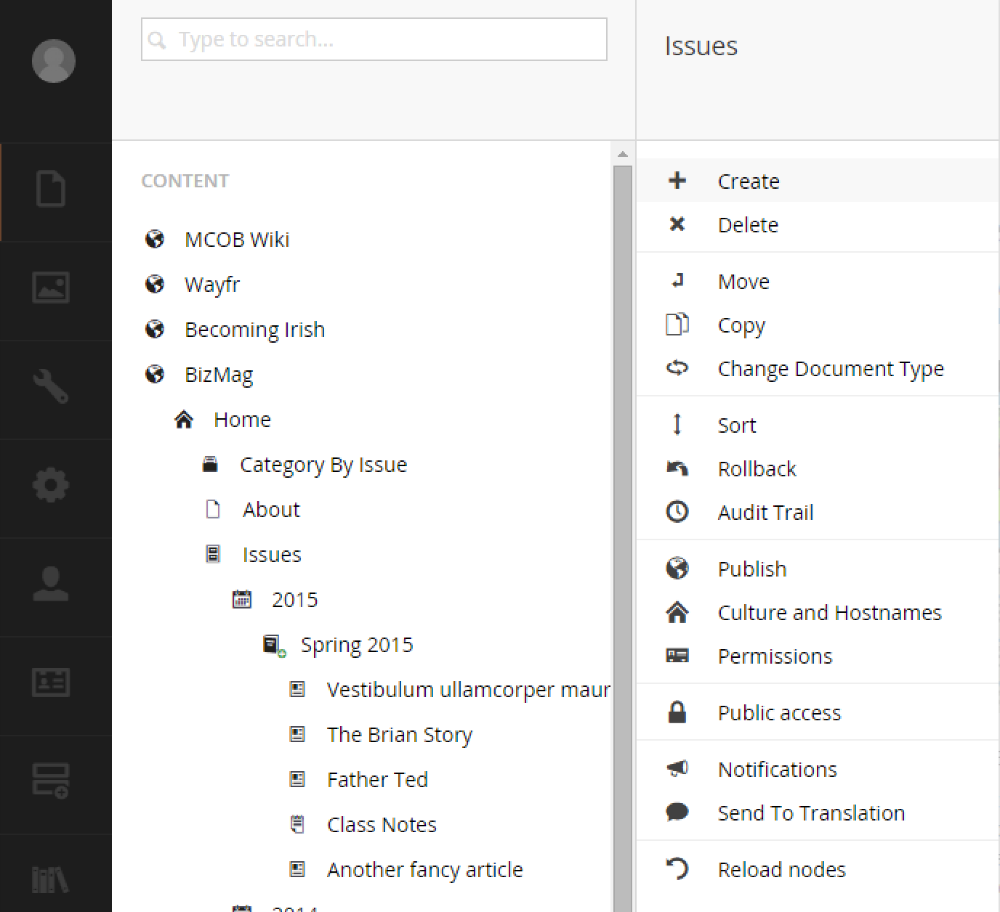
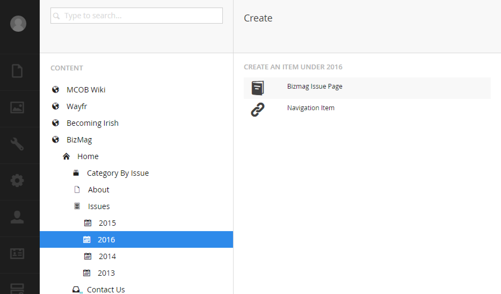

# Overview

So the concept is that you'll have to create an issue every time the magazine goes to print.  You'll create your issue under a year node.  You may need to add a new year before you add the next issue.

Creating new pages usually involves right-clicking another page and selecting `Create`.  From there you will be prompted to select 'what' it is you want to create:

To create a new issue, select `Bizmag Issue Page`.  You will then need to name and publish it.

Issue pages have unique inputs to tailor the look and feel of the issue.  For instance, you can add sliders to the top of the page by using the inputs next to the `Sliders` label.

Explore the tabs to see other things you can do.

The data you enter will be rendered by a template that will pull in data from within the issue such as articles and class notes.
