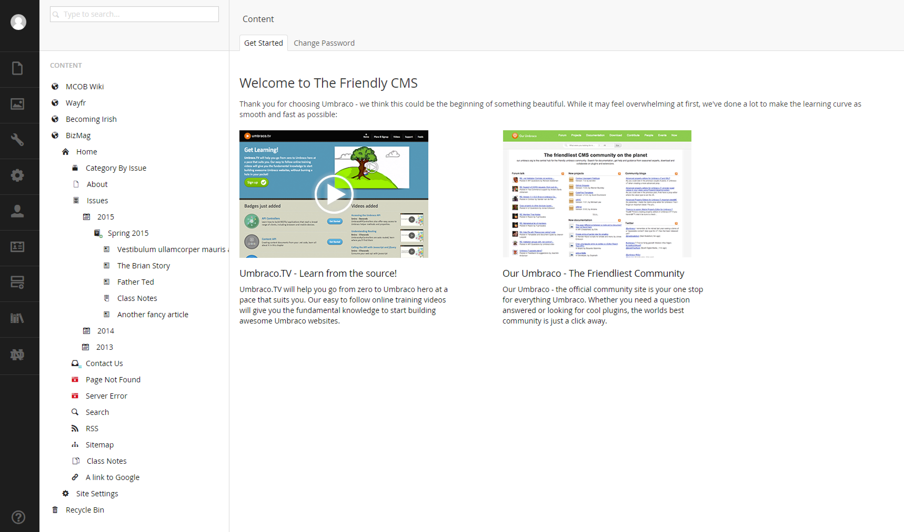
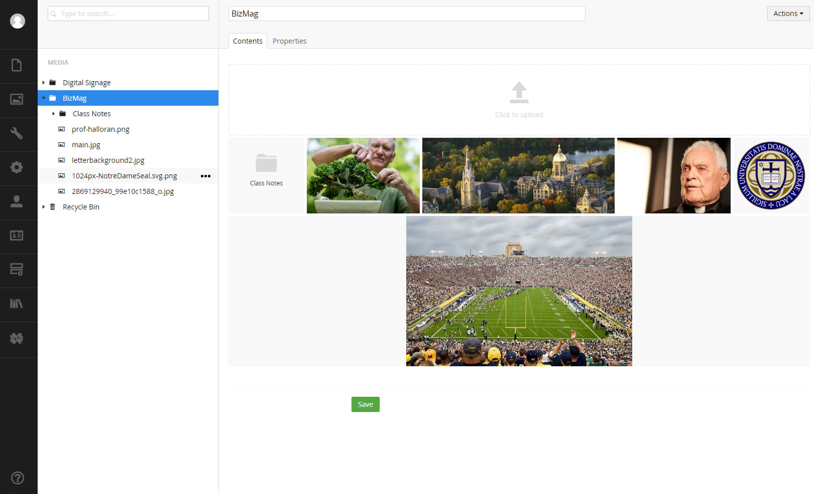

#Notre Dame Business Magazine#

This manual is intended for editors who might be adding content to the business magazine.

##Umbraco##
The business magazine is hosted inside the Umbraco content management system.

In general, editors will have access to two main sections:

* Content
* Media

Content is where you'll create actual pages while media is where you'll manage your images and PDFs.

##Content Section##

The content section is where you'll spend most of your time.  You will create, edit, save, publish and delete content from here.

##Media Section##

The media section is used to drag and drop your images from your desktop so that you can select them while in the content section.